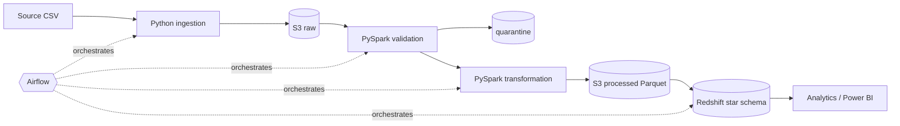

# food-delivery-data-platform

> An automated end-to-end data engineering platform for processing food delivery orders, customers, restaurants, payments, and delivery data using Python, PySpark, AWS S3, Amazon Redshift, Airflow, Docker, Terraform, and GitHub Actions.

**Status:** Phase 9 of 15 complete — synthetic data, raw ingestion, local/S3 lake storage, PySpark data quality and transformations, verified processed Parquet layer, star-schema warehouse (Redshift DDL + local PostgreSQL) with idempotent upserts and post-load checks, 15 analytics queries and 6 Power BI views, Airflow 3 orchestration and a CLI. The full README is written in Phase 15.

## Documentation

- Specifications (source of truth): [`docs/spec/`](docs/spec/)
- Implementation plan and traceability: [`docs/plans/00-master-implementation-plan.md`](docs/plans/00-master-implementation-plan.md)

## Architecture (target)



## Quick start (Phase 1)

Requirements: Docker Desktop (WSL2 backend on Windows).

```bash
cp .env.example .env                       # required (local warehouse password); never commit .env
docker compose build pipeline

# Generate the full historical dataset (~100k orders) into data/generated/
docker compose run --rm pipeline python -m scripts.generate_data --mode historical

# Generate one daily increment
docker compose run --rm pipeline python -m scripts.generate_data --mode incremental --date 2026-09-01

# Lint and tests
docker compose run --rm pipeline sh -c "ruff check . && ruff format --check . && pytest tests/unit"
```

### Run the pipeline

```bash
# CLI (no Airflow): same steps as the DAG
docker compose run --rm pipeline python -m src.cli init-warehouse
docker compose run --rm pipeline python -m src.cli run-pipeline --run-date 2026-08-31 --load-type historical
docker compose run --rm pipeline python -m src.cli run-pipeline --run-date 2026-09-01

# Airflow 3 UI at http://localhost:8080 (login: AIRFLOW_ADMIN_USERNAME / AIRFLOW_ADMIN_PASSWORD from .env)
docker compose up -d airflow
# Trigger food_delivery_pipeline with logical date 2026-08-31 and {"load_type": "historical"} first,
# then daily runs (2026-09-01, …). Unpausing the DAG also starts today's scheduled run.
docker compose stop airflow   # frees ~2 GB when only the CLI/tests are needed
```

A small deterministic sample dataset (historical + 2026-09-01 + 2026-09-02) is committed in [`data/sample/`](data/sample/).
