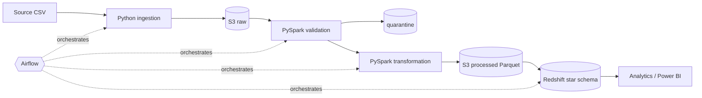

# food-delivery-data-platform

[](https://github.com/manishaj-code/food-delivery-data-platform/actions/workflows/ci.yml)

> An automated end-to-end data engineering platform for processing food delivery orders, customers, restaurants, payments, and delivery data using Python, PySpark, AWS S3, Amazon Redshift, Airflow, Docker, Terraform, and GitHub Actions.

**Status:** Phase 14 of 15 complete. CI/CD runs on GitHub Actions. The Terraform for the AWS `dev` environment is written and validated (fmt, validate, and mocked `terraform test`) but not yet applied. Monitoring covers pipeline metrics (log lines locally, CloudWatch in AWS mode), a failure alarm, a dashboard, and audit-table monitoring queries. Built so far: synthetic data, raw ingestion, local/S3 lake storage, PySpark data quality and transformations, verified processed Parquet layer, star-schema warehouse (Redshift DDL + local PostgreSQL) with idempotent upserts and post-load checks, 15 analytics queries and 6 Power BI views, Airflow 3 orchestration and a CLI, hardened Docker images and Compose environment, and an automated test suite (unit, data quality, integration, end-to-end; 96% coverage). The full README is written in Phase 15.

## Documentation

- Specifications (source of truth): [`docs/spec/`](docs/spec/)
- Implementation plan and traceability: [`docs/plans/00-master-implementation-plan.md`](docs/plans/00-master-implementation-plan.md)

## Architecture (target)



## Quick start (Docker)

Requirements: Docker Desktop (WSL2 backend on Windows). On an 8 GB machine, limit WSL2 in
`%UserProfile%\.wslconfig` (`[wsl2]` `memory=5GB`, `swap=4GB`).

```bash
cp .env.example .env         # required; set AIRFLOW_FERNET_KEY (command in the file). Never commit .env
docker compose build         # pipeline (dev target) + Airflow images
```

| Service | What it is |
|---|---|
| `postgres` | PostgreSQL 16: local warehouse (`warehouse`) + Airflow metadata (`airflow`) databases |
| `airflow-init` | one-off: creates/migrates the Airflow metadata database |
| `airflow` | Airflow 3 (`airflow standalone`), UI at http://localhost:8080 |
| `pipeline` | run-only CLI container; its entrypoint is `python -m src.cli` |

The pipeline image runs `python -m src.cli`, so pass CLI commands straight to it:

```bash
docker compose run --rm pipeline --help

# Synthetic source data into data/generated/: full history (~100k orders), then one day
docker compose run --rm pipeline generate-data --mode historical
docker compose run --rm pipeline generate-data --mode incremental --date 2026-09-01

# Pipeline without Airflow (same steps as the DAG)
docker compose run --rm pipeline init-warehouse
docker compose run --rm pipeline run-pipeline --run-date 2026-08-31 --load-type historical
docker compose run --rm pipeline run-pipeline --run-date 2026-09-01

# Analytics and pipeline monitoring (pipeline_run_audit) queries
docker compose run --rm pipeline run-analytics --query 08_top_restaurants
docker compose run --rm pipeline run-analytics --monitoring

# Lint and tests (override the entrypoint); integration tests use the postgres service
docker compose run --rm --entrypoint sh pipeline -c "ruff check . && ruff format --check . && pytest"
docker compose run --rm --entrypoint pytest pipeline -m "not aws" --cov=src   # + coverage
docker compose run --rm --entrypoint pytest pipeline -m unit                  # fast subset
```

### Airflow

```bash
docker compose up -d          # postgres, airflow-init, airflow; healthy in ~2 minutes
docker compose ps             # airflow: (healthy)
```

Log in with `AIRFLOW_ADMIN_USERNAME` / `AIRFLOW_ADMIN_PASSWORD` from `.env`. Trigger
`food_delivery_pipeline` with logical date 2026-08-31 and `{"load_type": "historical"}` first,
then daily runs (2026-09-01, …). Unpausing the DAG also starts today's scheduled run.
`docker compose stop airflow` frees ~2 GB when only the CLI/tests are needed;
`docker compose down -v` removes everything including the database volume.

### Notes

- The repository is bind-mounted into the containers, so code and DAG changes need no
  rebuild; `lake/`, `data/` and `airflow/logs/` are written by uid 1000 (`AIRFLOW_UID`).
  For faster file access on Windows, clone the repository inside the WSL2 filesystem.
- Images contain no `.env` or credentials and run as non-root users. For AWS mode, set
  `STORAGE_MODE=s3`, `WAREHOUSE_TYPE=redshift` and the AWS settings in `.env`, and add the
  read-only `~/.aws` mount: `docker compose -f docker-compose.yml -f docker-compose.aws.yml …`.
- `docker build .` builds the production `runtime` target (application code only, no dev
  tools); `--build-arg INSTALL_S3A_JARS=false` skips the ~650 MB S3 connector jars.

## CI/CD (GitHub Actions)

- [`ci.yml`](.github/workflows/ci.yml) runs on every push and on pull requests to `main`,
  with no AWS access and no secrets. It has four jobs:
  - `lint-test`: ruff, then pytest with coverage against a PostgreSQL service container.
  - `dag-integrity`: the DAG tests inside the Airflow image.
  - `docker-build`: both images, a smoke test, and a non-root check.
  - `terraform-validate`: fmt, init and validate.
- [`deploy.yml`](.github/workflows/deploy.yml) is started manually: Terraform `plan`, or `plan`
  then `apply` after approval on the `dev` environment. It signs in to AWS through GitHub
  OIDC only; no AWS keys are stored in GitHub. See Phase 13 for the repository variables it needs.

A small deterministic sample dataset (historical + 2026-09-01 + 2026-09-02) is committed in [`data/sample/`](data/sample/).
