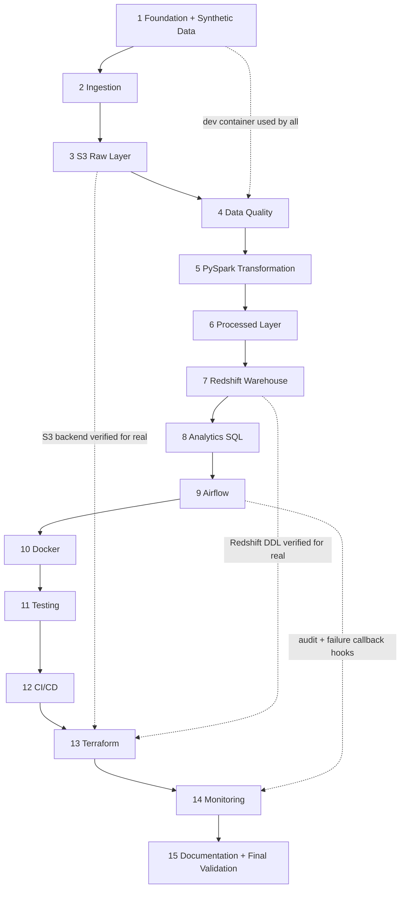

# 00 — Master Implementation Plan

Source of truth: `docs/spec/01` – `14`. This plan sequences the work into 15 phases, defines dependencies, deliverables, testing strategy, definition of done, and maps every requirement to a phase, test, and acceptance criterion.

---

## 1. Phases

| Phase | Name | Purpose | Plan |
|---|---|---|---|
| 1 | Project Foundation + Synthetic Data | Repo skeleton, config, logging, dev container, deterministic data generator | `phase-01-foundation.md` |
| 2 | Python Ingestion | Reusable ingestion framework writing to a raw layer (local storage) | `phase-02-ingestion.md` |
| 3 | S3 Raw Layer | Storage abstraction for S3, lake path conventions, partition overwrite | `phase-03-s3-raw-layer.md` |
| 4 | Data Quality | PySpark rule engine, quarantine, quality reports, quality gate | `phase-04-data-quality.md` |
| 5 | PySpark Transformation | Cleaning, conforming, derived fields, analytical datasets | `phase-05-pyspark-transformation.md` |
| 6 | Processed Data Layer | Parquet publishing, manifests, parent-key reads for incremental runs | `phase-06-processed-layer.md` |
| 7 | Redshift Warehouse | DDL (Redshift + PostgreSQL), dim_date, staging load, upserts, post-load checks | `phase-07-redshift.md` |
| 8 | Analytics SQL | 15 analytical queries, 6 Power BI views, metric tests | `phase-08-analytics.md` |
| 9 | Airflow | Pipeline step API, CLI, DAG, Airflow services in Compose | `phase-09-airflow.md` |
| 10 | Docker | Final images, Compose hardening, `.dockerignore`, non-root, healthchecks | `phase-10-docker.md` |
| 11 | Testing | Integration/e2e/idempotency/incremental tests, coverage, markers, gap filling | `phase-11-testing.md` |
| 12 | GitHub Actions CI/CD | `ci.yml`, `deploy.yml`, branch protection | `phase-12-cicd.md` |
| 13 | Terraform | AWS infrastructure + first real AWS run | `phase-13-terraform.md` |
| 14 | Monitoring | Metrics publisher, audit completeness, failure callback, CloudWatch alarm/dashboard | `phase-14-monitoring.md` |
| 15 | Documentation + Final Validation | README, `docs/`, Power BI guide, interview guide, final acceptance run | `phase-15-documentation.md` |

## 2. Phase Order and Dependencies

| Phase | Hard dependencies | Why |
|---|---|---|
| 2 | 1 | Needs config, logging, generated/sample data, constants. |
| 3 | 2 | Extends the storage interface created in Phase 2. |
| 4 | 3, 1 | Reads raw partitions via path conventions; needs Spark in dev container. |
| 5 | 4 | Consumes `validated/` output. |
| 6 | 5 | Publishes transformation output; provides parent keys back to Phase 4 referential checks. |
| 7 | 6 | Loads processed Parquet. |
| 8 | 7 | Queries warehouse tables. |
| 9 | 2–8 | Orchestrates all steps. |
| 10 | 9 | Finalises images that now include Airflow. |
| 11 | 1–10 | Cross-cutting integration/e2e tests need the full local pipeline. |
| 12 | 11 | CI runs the test suite and image builds. |
| 13 | 12, 3, 7 | CI validates Terraform; AWS run exercises S3 + Redshift code paths. |
| 14 | 13, 9 | CloudWatch resources exist; DAG hooks exist. |
| 15 | all | Documents final state; final acceptance run. |

## 3. Handling the Required Phase Order

The required order puts Docker (10) after Airflow (9) and Testing (11) after most code. To keep every phase verifiable:

- **Containers are introduced incrementally:** Phase 1 adds a minimal pipeline dev container (Python 3.12 + Java 21) because Spark on Windows is unreliable; Phase 7 adds the Postgres service; Phase 9 adds Airflow services; Phase 10 hardens and finalises everything.
- **Tests are written in every phase** (unit and data-quality tests alongside code). Phase 11 adds integration/e2e/idempotency/incremental tests, coverage targets, and fills gaps.
- **AWS is never a blocker:** Phases 3 and 7 verify S3/Redshift code paths with moto and local PostgreSQL; the first real AWS run happens in Phase 13 once Terraform exists.

## 4. Deliverables, Technologies, Expected Outputs

| Phase | Key deliverables | Technologies | Expected output |
|---|---|---|---|
| 1 | Repo skeleton, `pyproject.toml`, `requirements*.txt`, `.gitignore`, `.env.example`, `src/common/{config,logging_config,exceptions,constants}.py`, `scripts/generate_data.py`, `data/sample/`, dev `Dockerfile` + minimal compose | Python, Git, Docker | 100k-order historical dataset + manifest; sample data; green unit tests |
| 2 | `src/ingestion/*`, `src/common/storage.py` (local), `src/common/sources.py` | Python | `lake/raw/<dataset>/year=…/` CSVs with metadata |
| 3 | `S3Storage`, `src/common/paths.py`, overwrite semantics | boto3, moto | Identical layout in local and mocked S3 |
| 4 | `src/validation/*`, `src/common/spark.py` | PySpark | `validated/`, `quarantine/`, `reports/`; quality logs |
| 5 | `src/transformation/*` | PySpark | Transformed DataFrames + analytical datasets |
| 6 | Publisher, manifests, parent-key reader | PySpark, Parquet | `processed/<dataset>/year=…/` Parquet + `_manifest.json` |
| 7 | `sql/ddl/*`, `sql/staging/*`, `sql/warehouse/*`, `src/warehouse/*` | SQL, PostgreSQL, psycopg2 | Loaded local warehouse; post-load checks passing |
| 8 | `sql/analytics/*.sql`, `sql/analytics/views/*.sql` | SQL | 15 queries + 6 views returning expected metrics |
| 9 | `src/pipeline/steps.py`, `src/cli.py`, `airflow/dags/food_delivery_pipeline.py`, Airflow services | Airflow 3 | Green historical + incremental DAG runs |
| 10 | Final `Dockerfile`, `docker/airflow/Dockerfile`, `docker-compose.yml`, `docker/postgres/init.sql`, `.dockerignore` | Docker Compose | One-command local environment |
| 11 | Integration/e2e tests, markers, coverage config | pytest | ≥ 80% coverage on core packages |
| 12 | `.github/workflows/ci.yml`, `deploy.yml` | GitHub Actions | Green CI on `main` |
| 13 | `terraform/*.tf`, `terraform.tfvars.example` | Terraform, AWS | Provisioned `dev` env; pipeline run against S3 + Redshift |
| 14 | `src/common/metrics.py`, failure callback, audit completeness, `cloudwatch.tf` updates | CloudWatch | Metrics + alarm visible |
| 15 | `README.md`, `docs/*.md`, interview guide | Markdown, Mermaid | All AC checked |

## 5. Testing Strategy

| Level | Location | Scope | Runs in |
|---|---|---|---|
| Unit | `tests/unit/` | Pure functions/classes: config, logging, generator, ingestion, storage (moto), paths, transformations (small Spark DataFrames), metrics publisher, DAG integrity | CI + local |
| Data quality | `tests/data_quality/` | Each rule on crafted rows; catalogue ↔ spec 06; bad-record detection on sample data; report/score; quarantine format | CI + local |
| Integration | `tests/integration/` | Warehouse DDL/load/upserts/post-load checks and analytics SQL on PostgreSQL; processed layer; idempotency; incremental; local end-to-end run on `data/sample` | CI (Postgres service) + local |
| AWS smoke | marker `aws` | Real S3/Redshift round-trip | Manual only (Phase 13) |

Principles: tests use `data/sample/` or in-test fixtures (fast, deterministic); one session-scoped SparkSession fixture (`local[1]`, UTC, shuffle partitions = 1); no network or AWS in CI; hand-computed fixtures for every business metric.

pytest markers: `unit`, `spark`, `integration`, `aws`. CI command: `pytest -m "not aws"`.

## 6. Definition of Done (every phase)

A phase is done only when:

1. All tasks in the phase plan are implemented.
2. New code has tests; `pytest` for the phase's tests passes locally (in the container).
3. `ruff check` and `ruff format --check` pass.
4. The phase's relevant pipeline part runs on generated or sample data and its expected output is verified.
5. No secrets are committed; `.env.example` updated for new variables.
6. Specs/plans updated if implementation deviated.
7. Changes committed with conventional commit messages (e.g. `feat: implement raw data ingestion`).
8. A short phase summary is given: what was built, verification evidence, issues found and fixed.

## 7. Key Architectural Decisions

| # | Decision | Alternatives considered | Reason |
|---|---|---|---|
| KD-01 | Local-first with `STORAGE_MODE` and `WAREHOUSE_TYPE` switches | AWS-only; MinIO + LocalStack | AWS not a blocker; no extra emulators; same code path |
| KD-02 | PostgreSQL as local warehouse | DuckDB; Redshift only | Already required for Airflow; Redshift is PostgreSQL-derived |
| KD-03 | Custom PySpark DQ framework | Great Expectations | 34 fixed rules; less configuration; easy to explain |
| KD-04 | Validation in PySpark (not Pandas) | Pandas validation | One engine for validation + transformation; scales |
| KD-05 | `validated/` transient zone | Recomputing validity in transform; XCom | Task isolation through storage |
| KD-06 | Run-date (ingestion-date) partitioning in all zones | order_date partitions for facts | One batch = one partition → simple incremental loads and idempotent overwrites |
| KD-07 | UPDATE-then-INSERT upsert with stale-batch guard | DELETE+INSERT; MERGE | Preserves surrogate keys; identical on both engines; guards reruns |
| KD-08 | Redshift Serverless | Provisioned dc2/ra3 cluster | Cost when idle; simpler |
| KD-09 | Airflow 3 + LocalExecutor, Spark local mode inside Airflow | Celery; Spark cluster; MWAA | Minimal services |
| KD-10 | Compute local, AWS for storage/warehouse/monitoring | EC2/EMR/MWAA | Keeps AWS to the 5 required services |
| KD-11 | GitHub OIDC; manual, approved Terraform apply | Access-key secrets; auto-apply | Security; safety |
| KD-12 | Separate DDL per dialect, shared DML | One DDL with templating | Clarity; small duplication |

## 8. Traceability Matrix

Requirement → Specification → Phase → Test → Acceptance criterion. Specs: `03` = functional requirements; the detailed spec is listed where applicable.

| Requirement | Specification | Phase | Test | AC |
|---|---|---|---|---|
| FR-001 | 03, 05 §3–4 | 1 | tests/unit/test_generate_data.py | AC-001 |
| FR-002 | 03, 04 NFR-014 | 1 | tests/unit/test_generate_data.py | AC-002 |
| FR-003 | 03, 05 §2 | 1 | tests/unit/test_generate_data.py | AC-003 |
| FR-004 | 03, 05 §7 | 1 | tests/unit/test_generate_data.py; tests/data_quality/test_bad_record_detection.py | AC-003, AC-021 |
| FR-005 | 03, 05 §3, 07 §5 | 1 | tests/unit/test_generate_data.py | AC-004 |
| FR-006 | 03 | 1 | (used by all tests) | AC-092 |
| FR-007 | 03, 02 M-12 | 1 | tests/unit/test_generate_data.py | AC-083 |
| FR-010 | 03, 07 §3 | 2 | tests/unit/test_ingestion.py | AC-005 |
| FR-011 | 03, 07 §5 | 2 | tests/unit/test_ingestion.py | AC-005, AC-043 |
| FR-012 | 03 | 2 | tests/unit/test_ingestion.py | AC-006 |
| FR-013 | 03, 07 §12 | 2 | tests/unit/test_ingestion.py | AC-005 |
| FR-014 | 03, 07 §4 | 2, 3 | tests/unit/test_ingestion.py; tests/unit/test_paths.py | AC-005, AC-008 |
| FR-015 | 03, 12 §2 | 2 | tests/unit/test_ingestion.py | AC-005, AC-070 |
| FR-016 | 03, 07 §9–10 | 2 | tests/unit/test_ingestion.py | AC-006 |
| FR-017 | 03 | 2 | tests/unit/test_ingestion.py | AC-005 |
| FR-020 | 06 §2 | 4 | tests/data_quality/test_rule_catalog.py | AC-020 |
| FR-021 | 06 §2 | 4 | tests/data_quality/test_rules.py; test_bad_record_detection.py | AC-021 |
| FR-022 | 06 §3 | 4, 6 | tests/data_quality/test_rules.py | AC-026 |
| FR-023 | 06 §4 | 4 | tests/data_quality/test_quarantine.py | AC-022, AC-023 |
| FR-024 | 06 §5 | 4 | tests/data_quality/test_quality_report.py | AC-024, AC-027 |
| FR-025 | 06 §5 | 4 | tests/data_quality/test_quality_report.py | AC-025 |
| FR-026 | 06 §6 | 7 | tests/integration/test_post_load_checks.py | AC-036 |
| FR-030 | 07 §7 | 5 | tests/unit/test_transformations.py | AC-009 |
| FR-031 | 07 §7 | 5 | tests/unit/test_transformations.py | AC-010 |
| FR-032 | 07 §7 | 5 | tests/unit/test_transformations.py | AC-009 |
| FR-033 | 07 §6–7 | 5 | tests/unit/test_transformations.py | AC-009 |
| FR-034 | 07 §7 | 5 | tests/unit/test_transformations.py | AC-009 |
| FR-035 | 07 §7 | 5 | tests/unit/test_transformations.py | AC-010 |
| FR-036 | 07 §7 | 5 | tests/unit/test_metric_calculations.py | AC-011 |
| FR-037 | 07 §6, 02 M-03 | 5, 6 | tests/unit/test_metric_calculations.py | AC-009, AC-011 |
| FR-040 | 07 §4 | 3, 6 | tests/unit/test_paths.py | AC-005, AC-009 |
| FR-041 | 07 §4 | 3 | tests/unit/test_paths.py | AC-005 |
| FR-042 | 07 §6 | 6 | tests/integration/test_processed_layer.py | AC-009 |
| FR-043 | 07 §4, 09 §7 | 2, 3 | tests/unit/test_storage.py | AC-007 |
| FR-044 | 07 §8 | 3, 6 | tests/unit/test_storage.py; tests/integration/test_processed_layer.py | AC-033 |
| FR-050 | 08 §4–6 | 7 | tests/integration/test_warehouse_load.py | AC-030 |
| FR-051 | 08 §4 | 7 | tests/integration/test_warehouse_load.py | AC-031 |
| FR-052 | 08 §7 | 7, 13 | tests/integration/test_warehouse_load.py | AC-032, AC-037 |
| FR-053 | 08 §7 | 7 | tests/integration/test_incremental.py | AC-034 |
| FR-054 | 08 §5, §7 | 7 | tests/integration/test_warehouse_load.py | AC-032, AC-036 |
| FR-055 | 08 §7 | 7 | tests/integration/test_warehouse_load.py | AC-030 |
| FR-056 | 08 §1, 09 §7 | 7 | tests/integration/test_warehouse_load.py | AC-030 |
| FR-060 | 02 §4 | 8 | tests/integration/test_analytics_sql.py | AC-080 |
| FR-061 | 08 §8 | 8 | tests/integration/test_analytics_sql.py | AC-081 |
| FR-062 | 02 §5–6 | 8 | tests/integration/test_analytics_sql.py | AC-082 |
| FR-063 | 08 §9 | 15 | inspection | AC-084 |
| FR-070 | 07 §3 | 9 | tests/unit/test_dag_integrity.py | AC-040, AC-042 |
| FR-071 | 07 §3 | 9 | tests/unit/test_dag_integrity.py | AC-046 |
| FR-072 | 07 §9 | 9 | tests/unit/test_dag_integrity.py; tests/unit/test_pipeline_steps.py | AC-041, AC-044 |
| FR-073 | 07 §11 | 9 | tests/unit/test_pipeline_steps.py | AC-045 |
| FR-074 | 12 §7 | 9, 14 | tests/unit/test_pipeline_steps.py | AC-073 |
| FR-075 | 12 §4 | 9, 14 | tests/integration/test_pipeline_e2e.py | AC-071 |
| FR-076 | 07 §5 | 9 | tests/unit/test_dag_integrity.py | AC-041, AC-042 |
| FR-080 | 07 §5 | 1, 2, 9 | tests/integration/test_incremental.py | AC-043 |
| FR-081 | 07 §5 | 9 | tests/integration/test_pipeline_e2e.py | AC-042 |
| FR-082 | 07 §5 | 5, 6, 7 | tests/integration/test_incremental.py | AC-043 |
| FR-083 | 07 §5, 08 §7 | 7 | tests/integration/test_incremental.py | AC-034, AC-035 |
| FR-090 | 07 §8 | 2, 3 | tests/unit/test_storage.py; tests/integration/test_idempotency.py | AC-033 |
| FR-091 | 07 §8 | 4, 6 | tests/integration/test_idempotency.py | AC-033 |
| FR-092 | 08 §7 | 7 | tests/integration/test_idempotency.py | AC-033 |
| FR-093 | 12 §4 | 9, 14 | tests/integration/test_idempotency.py | AC-071 |
| FR-100 | 07 §11 | 1 | tests/unit/test_logging_config.py | AC-045 |
| FR-101 | 12 §2 | 2–9 | tests/integration/test_pipeline_e2e.py | AC-070 |
| FR-102 | 12 §4 | 7, 14 | tests/integration/test_pipeline_e2e.py | AC-071 |
| FR-103 | 12 §3 | 14 | tests/unit/test_metrics_publisher.py | AC-072, AC-074 |
| FR-104 | 12 §6 | 14 | terraform validate (CI) | AC-073 |
| FR-105 | 12 §2 | 9 | tests/integration/test_pipeline_e2e.py | AC-070 |
| FR-110 | 10 §3 | 12 | CI run evidence | AC-052, AC-053 |
| FR-111 | 10 §3 | 12 | CI run evidence | AC-054 |
| FR-112 | 10 §3, 11 §5 | 12, 13 | deploy workflow run | AC-062 |
| FR-113 | 10 §2–3 | 10, 12 | CI docker-build job | AC-051 |
| FR-114 | 10 §1 | 1–15 | git log inspection | AC-056 |
| FR-120 | 10 §4 | 13 | terraform validate (CI) | AC-054 |
| FR-121 | 09 §3.1 | 13 | terraform plan + console check | AC-063 |
| FR-122 | 09 §3.3 | 13 | policy review | AC-065 |
| FR-123 | 09 §3.2 | 13 | AWS smoke run (marker `aws`) | AC-037, AC-055 |
| FR-124 | 09 §3.4 | 13, 14 | terraform plan | AC-073 |
| FR-125 | 09, 10 §4 | 13 | terraform validate | AC-054 |
| FR-126 | 10 §2 | 1, 10 | CI docker-build job | AC-051, AC-066 |
| FR-127 | 10 §2 | 7, 9, 10 | manual compose run | AC-050 |
| FR-130 | 11 §9 | 1 | inspection | AC-060, AC-061 |
| FR-131 | 11 §3–4 | 1, 13 | tests/unit/test_config.py | AC-064 |
| FR-132 | 11 §2 | 13 | policy review | AC-065 |
| FR-133 | 11 §5 | 12, 13 | workflow inspection | AC-062 |
| FR-134 | 11 §7 | 13 | console check | AC-063 |
| FR-135 | 11 §8, §11 | 7, 13 | tests/unit/test_config.py | AC-064 |
| FR-136 | 11 §9–10 | 10 | image inspection | AC-066 |

Non-functional requirements are verified in Phase 11 (NFR-003, NFR-012, NFR-013), Phase 13 (NFR-017, NFR-022), and Phase 15 (NFR-001, NFR-002, NFR-015, NFR-016).

## 9. Working Agreement Per Phase

For every phase (from `project_details.md` §38): explain what is being built → show proposed files → implement → run/verify tests → show what was completed → identify issues → fix → only then move on. Each phase ends with a commit and a short summary.
