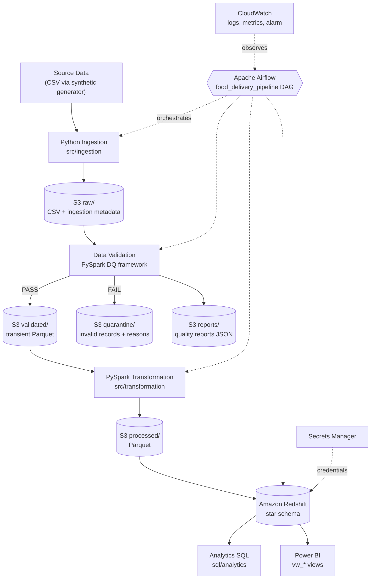

# 01 — Project Overview

| Item | Value |
|---|---|
| Project name | `food-delivery-data-platform` |
| Document status | Draft v1.0 — source of truth for implementation |
| Primary requirements source | `project_details.md` |
| Related specs | All documents in `docs/spec/` |

---

## 1. Project Purpose

> An automated end-to-end data engineering platform for processing food delivery orders, customers, restaurants, payments, and delivery data using Python, PySpark, AWS S3, Amazon Redshift, Airflow, Docker, Terraform, and GitHub Actions.

The project is a **portfolio-quality** system. Its purpose is to demonstrate production-style data engineering and DevOps practices in a codebase that **one developer can build, run, test, deploy, and explain in a technical interview**.

## 2. Business Context

A fictional food delivery company (operating in Indian cities, currency INR) collects operational data about:

- Customers
- Restaurants
- Orders
- Payments
- Deliveries
- Delivery partners

Today this data sits in separate operational exports (CSV files). Nobody can answer basic questions such as "what was yesterday's revenue?" or "which restaurants have the highest cancellation rate?" without manual spreadsheet work.

## 3. Problem Statement

The company needs a reliable, automated, daily batch data platform that:

1. Collects operational data from source systems.
2. Validates it and isolates bad records instead of silently loading them.
3. Cleans and transforms it into an analytics-friendly model.
4. Stores it in a data lake (S3) and a data warehouse (Redshift).
5. Exposes trustworthy business metrics to analysts and Power BI.
6. Runs automatically, incrementally, and safely (re-runs never duplicate data).

## 4. Goals

| ID | Goal |
|---|---|
| G-1 | Automate daily ingestion → validation → transformation → warehouse load. |
| G-2 | Guarantee data quality through explicit, documented rules and a quarantine zone. |
| G-3 | Provide a star-schema warehouse and Power BI-ready views for the key business metrics. |
| G-4 | Make the pipeline incremental and idempotent. |
| G-5 | Make the whole pipeline runnable locally without an AWS account. |
| G-6 | Manage AWS infrastructure as code (Terraform) and validate every change through CI (GitHub Actions). |
| G-7 | Provide observability: logs, record counts, quality scores, durations, failures. |
| G-8 | Produce documentation good enough to explain every design decision in an interview. |

## 5. Scope

**In scope**

- Deterministic synthetic data generator (historical + daily increments) with intentionally bad records.
- Python ingestion framework (CSV source, pluggable for a future API source).
- S3 data lake with `raw`, `validated`, `processed`, `quarantine`, `reports` zones (local filesystem equivalent for development).
- Custom lightweight data-quality framework (PySpark-based).
- PySpark transformations producing Parquet.
- Redshift star schema (4 dimensions, 3 facts), upsert loading, analytical SQL and Power BI views.
- Local warehouse mode using PostgreSQL.
- Apache Airflow DAG orchestrating the full pipeline.
- Docker / Docker Compose local environment.
- pytest unit, data-quality, and integration tests.
- GitHub Actions CI (lint, test, Docker build, Terraform validate) and a manual deploy workflow.
- Terraform for S3, IAM, Redshift Serverless, CloudWatch, Secrets Manager integration.
- CloudWatch metrics, alarm, and logging.
- README and `docs/` documentation.

## 6. Out of Scope

- Real-time/streaming ingestion (Kafka, Kinesis).
- Kubernetes/EKS, microservices, Lambda-heavy designs.
- Databricks, Snowflake, EMR, Glue jobs.
- Building Power BI reports inside the repository (only Power BI-ready views + connection docs).
- A real source API (only an extension point is provided).
- SCD Type 2 history (dimensions are SCD Type 1 — see `08-data-warehouse-specification.md`).
- Automated re-processing of quarantined records (manual, documented procedure only).
- Multi-environment production deployment (only a `dev` AWS environment is provisioned; the `environment` variable allows more later).
- High availability, disaster recovery, and enterprise SLAs.

## 7. Target Users

| User | Needs |
|---|---|
| Business analysts / managers | Daily KPIs via Power BI dashboards. |
| Data analysts | Clean SQL-accessible star schema and views in Redshift. |
| Data engineers (project owner) | Maintainable, testable, observable pipeline. |
| Interviewers / reviewers | Clear architecture, documentation, and evidence of engineering practice. |

## 8. Technology Stack

| Area | Technology | Notes |
|---|---|---|
| Language | Python 3.12 | Type hints, standard `logging`. |
| Processing | PySpark 4.x (local mode) | Validation + transformation. Java 21 runtime required. |
| Tabular helpers | Pandas | Only where appropriate (e.g. small local warehouse staging loads). |
| SQL | Redshift SQL (PostgreSQL-compatible subset for local mode) | DDL, upserts, analytics, views. |
| Data lake | Amazon S3 (local filesystem in dev) | CSV raw, Parquet processed. |
| Warehouse | Amazon Redshift Serverless (PostgreSQL 16 locally) | Star schema. |
| Orchestration | Apache Airflow 3.x, LocalExecutor | PostgreSQL metadata DB. |
| Containers | Docker, Docker Compose | Local development runtime. |
| IaC | Terraform 1.16 (≥ 1.16, < 2), AWS provider 6.x | `terraform/`. |
| CI/CD | GitHub Actions | `ci.yml`, `deploy.yml`, OIDC to AWS. |
| Testing | pytest, moto (S3 mocking) | Custom DQ framework instead of Great Expectations. |
| Linting | ruff (lint + format check) | Single tool. |
| Security | IAM, Secrets Manager, GitHub OIDC | No secrets in Git. |
| Monitoring | Python logging, Airflow logs, CloudWatch metrics/logs/alarms | Audit table in warehouse. |
| BI | Power BI (external) | Consumes Redshift views. |
| VCS | Git, GitHub | GitHub Flow, conventional commits. |

Exact library versions are pinned in Phase 1 (`requirements.txt`) and must be compatible with Python 3.12.

## 9. High-Level Architecture



**Local development mode** keeps the exact same flow but replaces S3 with a local folder (`./lake/`) and Redshift with a PostgreSQL database, so no AWS account is needed for development and testing (see `09-aws-infrastructure-specification.md` §7).

## 10. Major Components

| Component | Location | Responsibility |
|---|---|---|
| Synthetic data generator | `scripts/generate_data.py` | Generate historical + daily source CSVs with controlled bad records. |
| Common library | `src/common/` | Config, logging, exceptions, storage abstraction, Spark session, metrics. |
| Ingestion | `src/ingestion/` | Read source → structural checks → add metadata → write raw. |
| Validation | `src/validation/` | Rule catalogue, rule engine, quarantine, quality reports, post-load checks. |
| Transformation | `src/transformation/` | Cleaning, conforming, derived fields, processed Parquet. |
| Warehouse | `src/warehouse/`, `sql/` | DDL, staging load, upserts, dim_date, analytics views. |
| Pipeline entry points | `src/pipeline/`, `src/cli.py` | Step functions shared by Airflow and CLI. |
| Orchestration | `airflow/dags/` | Thin DAG calling pipeline steps. |
| Containers | `Dockerfile`, `docker/`, `docker-compose.yml` | Local runtime. |
| Infrastructure | `terraform/` | AWS resources. |
| CI/CD | `.github/workflows/` | Lint, test, build, Terraform validate/plan/apply. |
| Tests | `tests/` | unit, data_quality, integration. |
| Docs | `README.md`, `docs/` | Specs, plans, operational docs. |

## 11. Target Repository Structure

```text
food-delivery-data-platform/
├── src/
│   ├── common/          # config, logging, exceptions, storage, spark, metrics
│   ├── ingestion/
│   ├── validation/
│   ├── transformation/
│   ├── warehouse/
│   ├── pipeline/        # step functions used by Airflow + CLI
│   └── cli.py
├── airflow/dags/
├── data/
│   ├── sample/          # small committed dataset for tests/demo
│   └── generated/       # generator output (git-ignored)
├── scripts/generate_data.py
├── sql/{ddl,staging,warehouse,analytics}/
├── tests/{unit,integration,data_quality}/
├── terraform/
├── docker/
├── .github/workflows/
├── docs/{spec,plans}/ + operational docs
├── .env.example, .gitignore, .dockerignore
├── Dockerfile, docker-compose.yml
├── requirements.txt, requirements-dev.txt, pyproject.toml
└── README.md
```

Additions relative to `project_details.md` §27 are `src/pipeline/`, `src/cli.py`, `requirements-dev.txt`, `.dockerignore` — each justified in the relevant spec.

## 12. Expected Final Outcome

- `docker compose up` starts Airflow + PostgreSQL + the pipeline application locally.
- Triggering the DAG with `load_type=historical` builds the initial warehouse from ~100k orders; daily scheduled runs process only new/changed data.
- Invalid records land in quarantine with rule IDs; each run produces a quality report (e.g. orders quality score ≈ 99.9%).
- Re-running any run date yields identical warehouse row counts (idempotent).
- Six Power BI views answer the KPIs defined in `02-business-requirements.md`.
- Every push/PR runs lint, tests, Docker build, and Terraform validation in GitHub Actions.
- `terraform apply` provisions the AWS environment; the same pipeline then runs against S3 + Redshift Serverless by changing environment variables only.
- The documentation (README, `docs/`) explains architecture, data flow, operations, and trade-offs.
