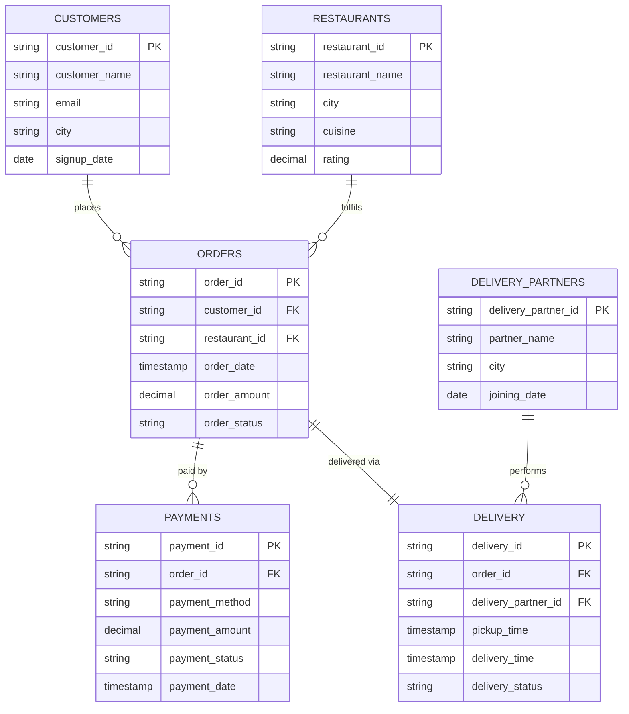

# 05 — Source Data Model Specification

This document defines the **source (operational) data model** — the CSV files produced by the synthetic generator and read by ingestion. The warehouse model is in `08-data-warehouse-specification.md`.

---

## 1. Conventions

| Convention | Decision |
|---|---|
| File format | CSV, UTF-8, comma-separated, header row, `"` quoting, `\n` line endings. |
| Empty value | Empty field = NULL. |
| Timestamp format | `YYYY-MM-DD HH:MM:SS`, UTC, no timezone suffix. |
| Date format | `YYYY-MM-DD`. |
| Decimal format | `.` decimal separator, 2 decimals, no thousands separator. |
| Types below | *Logical* types. In raw CSV everything is text; types are enforced by validation (spec 06) and transformation (spec 07). |
| Keys | All IDs are string business keys with a fixed prefix. |
| Mutability | `customers`, `restaurants`, `delivery_partners` can change (SCD1). `orders`, `payments`, `delivery` can receive status updates in later daily files. |

## 2. Entity-Relationship Diagram



### Relationships

| Relationship | Cardinality | Rule |
|---|---|---|
| customers → orders | 1 : 0..N | `orders.customer_id` must exist in customers. |
| restaurants → orders | 1 : 0..N | `orders.restaurant_id` must exist in restaurants. |
| orders → payments | 1 : 0..N (generator creates exactly 1) | `payments.order_id` must exist in orders. Model allows retries/multiple attempts. |
| orders → delivery | 1 : 0..1 (generator creates exactly 1) | `delivery.order_id` must exist in orders. |
| delivery_partners → delivery | 1 : 0..N | `delivery.delivery_partner_id` must exist in delivery_partners. |

## 3. Source File Layout

```text
data/generated/
├── customers/customers_historical.csv
├── customers/customers_2026-09-29.csv          # incremental file per date
├── restaurants/…
├── orders/…
├── payments/…
├── delivery/…
├── delivery_partners/…
├── _bad_records_manifest_historical.json
└── _bad_records_manifest_2026-09-29.json     # one manifest per generated label
```

- Historical: `<dataset>/<dataset>_historical.csv` (covers 2026-01-01 → 2026-08-31).
- Incremental: `<dataset>/<dataset>_<YYYY-MM-DD>.csv`. Always written for all six datasets; may be header-only (0 rows).
- `data/sample/` uses the same layout with a tiny dataset (committed).

## 4. Entities

### 4.1 customers

**Purpose:** people who place orders. **Business key:** `customer_id`.

| Column | Type | Nullable | Description | Example |
|---|---|---|---|---|
| customer_id | VARCHAR(10) | No | `C` + 5 digits, C10001–C20000 historical, sequential for new customers | `C10001` |
| customer_name | VARCHAR(100) | No | Full name | `Rahul Sharma` |
| email | VARCHAR(150) | Yes | Email address | `rahul@example.com` |
| city | VARCHAR(50) | No | One of the supported cities | `Pune` |
| signup_date | DATE | No | Account creation date | `2026-01-10` |

### 4.2 restaurants

**Purpose:** restaurants that fulfil orders. **Business key:** `restaurant_id`.

| Column | Type | Nullable | Description | Example |
|---|---|---|---|---|
| restaurant_id | VARCHAR(10) | No | `R` + 4 digits, R1001–R1500 | `R1001` |
| restaurant_name | VARCHAR(100) | No | Name | `Spice Kitchen` |
| city | VARCHAR(50) | No | Supported city | `Pune` |
| cuisine | VARCHAR(50) | No | Supported cuisine | `Indian` |
| rating | DECIMAL(2,1) | Yes | 0.0 – 5.0 | `4.3` |

### 4.3 delivery_partners

**Purpose:** riders who deliver orders. **Business key:** `delivery_partner_id`.

| Column | Type | Nullable | Description | Example |
|---|---|---|---|---|
| delivery_partner_id | VARCHAR(10) | No | `DP` + 4 digits, DP1001–DP2000 | `DP1001` |
| partner_name | VARCHAR(100) | No | Full name | `Amit Patil` |
| city | VARCHAR(50) | No | Operating city | `Pune` |
| joining_date | DATE | No | Joining date | `2025-11-02` |

### 4.4 orders

**Purpose:** an order placed by a customer at a restaurant. **Business key:** `order_id`.

| Column | Type | Nullable | Description | Example |
|---|---|---|---|---|
| order_id | VARCHAR(12) | No | `ORD` + 7 digits | `ORD0000001` |
| customer_id | VARCHAR(10) | No | FK → customers | `C10001` |
| restaurant_id | VARCHAR(10) | No | FK → restaurants | `R1001` |
| order_date | TIMESTAMP | No | Order placed date-time (UTC). Named `order_date` per requirements but carries time-of-day, needed for peak-hour analysis. | `2026-09-29 13:05:42` |
| order_amount | DECIMAL(10,2) | No | Order total, ≥ 0 | `456.50` |
| order_status | VARCHAR(20) | No | `PLACED`, `PREPARING`, `OUT_FOR_DELIVERY`, `DELIVERED`, `CANCELLED` | `DELIVERED` |

### 4.5 payments

**Purpose:** a payment attempt for an order. **Business key:** `payment_id`.

| Column | Type | Nullable | Description | Example |
|---|---|---|---|---|
| payment_id | VARCHAR(12) | No | `PAY` + 7 digits | `PAY0000001` |
| order_id | VARCHAR(12) | No | FK → orders | `ORD0000001` |
| payment_method | VARCHAR(10) | No | `UPI`, `CARD`, `CASH`, `WALLET` | `UPI` |
| payment_amount | DECIMAL(10,2) | No | ≥ 0; equals order_amount for generated clean data | `456.50` |
| payment_status | VARCHAR(10) | No | `SUCCESS`, `FAILED`, `REFUNDED` | `SUCCESS` |
| payment_date | TIMESTAMP | No | Payment date-time (UTC) | `2026-09-29 13:06:10` |

### 4.6 delivery

**Purpose:** delivery of an order by a partner. **Business key:** `delivery_id`.

| Column | Type | Nullable | Description | Example |
|---|---|---|---|---|
| delivery_id | VARCHAR(12) | No | `DEL` + 7 digits | `DEL0000001` |
| order_id | VARCHAR(12) | No | FK → orders | `ORD0000001` |
| delivery_partner_id | VARCHAR(10) | No | FK → delivery_partners | `DP1001` |
| pickup_time | TIMESTAMP | Yes | NULL while `ASSIGNED` or if failed before pickup | `2026-09-29 13:25:00` |
| delivery_time | TIMESTAMP | Yes | NULL unless `DELIVERED` | `2026-09-29 13:57:30` |
| delivery_status | VARCHAR(12) | No | `ASSIGNED`, `PICKED_UP`, `DELIVERED`, `FAILED` | `DELIVERED` |

## 5. Reference Values

| Domain | Values |
|---|---|
| Cities | Pune, Mumbai, Bengaluru, Delhi, Hyderabad, Chennai, Kolkata, Ahmedabad |
| Cuisines | Indian, South Indian, Chinese, Italian, Mughlai, Fast Food, Continental, Desserts |
| order_status | PLACED, PREPARING, OUT_FOR_DELIVERY, DELIVERED, CANCELLED |
| payment_method | UPI, CARD, CASH, WALLET |
| payment_status | SUCCESS, FAILED, REFUNDED |
| delivery_status | ASSIGNED, PICKED_UP, DELIVERED, FAILED |

Reference values live in one module (`src/common/constants.py`) used by the generator, validation, and tests.

## 6. Generator Consistency Rules (clean records)

| Order status | Payment status | Delivery status | Times |
|---|---|---|---|
| DELIVERED | SUCCESS | DELIVERED | pickup 10–30 min after order; delivery 15–60 min after pickup (~10% > 45 min) |
| CANCELLED | REFUNDED or FAILED | FAILED | pickup and delivery NULL |
| PLACED / PREPARING | SUCCESS | ASSIGNED | both NULL (only on most recent days) |
| OUT_FOR_DELIVERY | SUCCESS | PICKED_UP | pickup set, delivery NULL |

Target historical distribution: ~93% DELIVERED, ~7% CANCELLED, a few in-flight orders on the last day (placed at/after 22:00); ~93% payment SUCCESS overall (cancelled orders are REFUNDED or FAILED); ~10% of deliveries late (> 45 min). Verified on the seed-42 full dataset in Phase 1. Daily increments contain ~500 new orders (with payment + delivery), ~20 new customers, and ~50 updates to earlier in-flight orders (new status, same `order_id`), with matching payment/delivery updates.

## 7. Intentional Bad Records

Injected by the generator (FR-004) and recorded in `_bad_records_manifest_<label>.json` by rule ID (rules in spec 06). Historical defaults:

| Dataset | Defect | Count | Detected by |
|---|---|---|---|
| customers | NULL customer_id | 5 | DQ-CUS-001 |
| customers | duplicate customer_id (extra copies) | 5 | DQ-CUS-002 |
| customers | NULL city | 3 | DQ-CUS-003 |
| customers | invalid signup_date (`2026-02-30`, `not-a-date`) | 3 | DQ-CUS-004 |
| restaurants | duplicate restaurant_id | 2 | DQ-RES-002 |
| restaurants | rating out of range (e.g. `7.5`, `-1`) | 3 | DQ-RES-003 |
| orders | NULL customer_id | 10 | DQ-ORD-003 |
| orders | duplicate order_id (extra copies) | 10 | DQ-ORD-002 |
| orders | negative order_amount | 10 | DQ-ORD-006 |
| orders | missing restaurant (unknown restaurant_id) | 10 | DQ-ORD-005 |
| orders | invalid order_date | 10 | DQ-ORD-008 |
| orders | invalid order_status | 5 | DQ-ORD-007 |
| payments | invalid payment_amount (negative / non-numeric) | 10 | DQ-PAY-004 |
| payments | invalid payment_status | 5 | DQ-PAY-005 |
| delivery | pickup_time after delivery_time | 10 | DQ-DEL-005 |

Daily increments inject bad records only into orders, payments, and delivery (~0.5%) so small dimension files do not trip the 95% quality gate.

**Cascade effect:** when an order is quarantined, its payment and delivery fail the referential rules (DQ-PAY-003, DQ-DEL-003). The manifest counts are therefore *minimums*; tests assert `detected ≥ manifest`.
