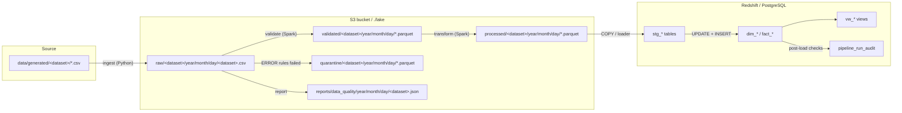

# 07 — Data Pipeline Specification

Covers FR-010 – FR-044, FR-070 – FR-093. Related: spec 05 (source model), spec 06 (quality), spec 08 (warehouse), spec 12 (monitoring).

---

## 1. End-to-End Flow

```text
Source (CSV)
 ↓
Python ingestion          src/ingestion        (+ metadata columns)
 ↓
S3 Raw                    raw/                 (CSV, unchanged values)
 ↓
Validation                src/validation       (PySpark rule engine)
 ↓                ↘
Validated (transient)     Quarantine           validated/ , quarantine/ , reports/
 ↓
PySpark transformation    src/transformation
 ↓
S3 Processed              processed/           (Parquet)
 ↓
Redshift                  staging → upsert → dims/facts
 ↓
Post-load DQ checks + Analytics views
```

## 2. Data-Flow Diagram



## 3. Pipeline Stages

| # | Stage | Module / entry point | Input | Output | Engine |
|---|---|---|---|---|---|
| 0 | Prepare source | `steps.prepare_source_data` | run date, load type | source CSV exists (generates the daily increment if missing, simulating the source system) | Python |
| 1 | Ingest | `steps.ingest_dataset(dataset)` | source CSV | `raw/` CSV + metadata | Python (csv module) |
| 2 | Validate | `steps.validate_data` | `raw/` partition, `processed/` parent keys | `validated/`, `quarantine/`, `reports/`, audit rows | PySpark |
| 3 | Transform | `steps.transform_data` | `validated/` partition, processed dims | staged output `_tmp/<run_id>/processed/` + `_staged.json` | PySpark |
| 4 | Publish processed | `steps.publish_processed` | staged output | verified `processed/` partitions + `_manifest.json` | Python (pyarrow) |
| 5 | Load warehouse | `steps.load_warehouse` | `processed/` partition | `stg_*`, `dim_*`, `fact_*` | SQL (Redshift/PostgreSQL) |
| 6 | Post-load checks | `steps.run_dq_checks` | warehouse | pass/fail, audit rows | SQL |
| 7 | Summary | `steps.pipeline_summary` | XCom results + audit | log summary, metrics | Python |

`src/pipeline/steps.py` is the only API the DAG and the CLI (`python -m src.cli run-step …` / `run-pipeline …`) use.

### Why a `validated/` zone?

Validation and transformation are separate Airflow tasks (required DAG shape). Tasks must exchange data through storage, not XCom. `validated/` holds typed, rule-passing records for one run and expires after 7 days. It is the only zone added beyond `project_details.md` §10.

## 4. Lake Layout

```text
<bucket or ./lake>/
├── raw/<dataset>/year=YYYY/month=MM/day=DD/<dataset>.csv
├── validated/<dataset>/year=YYYY/month=MM/day=DD/part-*.parquet
├── quarantine/<dataset>/year=YYYY/month=MM/day=DD/part-*.parquet
├── processed/<dataset>/year=YYYY/month=MM/day=DD/part-*.parquet
│     datasets: customers, restaurants, delivery_partners, orders, payments, delivery,
│               order_analytics, daily_order_metrics
│     + processed/<dataset>/year=…/_manifest.json   (dataset, run_id, run_date, row_count,
│       files, schema, source_partitions, created_at; Spark and pyarrow skip files
│       starting with "_", and Redshift COPY uses the `…/part-` key prefix so it
│       never picks up the manifest)
├── reports/
│   ├── data_quality/year=YYYY/month=MM/day=DD/<dataset>.json
│   └── audit/year=YYYY/month=MM/day=DD/<stage>__<dataset>.json   # stage results, inserted into pipeline_run_audit by pipeline_summary
└── _tmp/<run_id>/<zone>/<dataset>/                                # run-scoped staging for partition replacement; emptied after publish
```

- Partition date = **run (ingestion) date** (Airflow logical date `ds`). Example: `processed/orders/year=2026/month=09/day=29/`.
- Local mode root: `LOCAL_LAKE_PATH` (default `./lake`), S3 mode: `s3://$S3_BUCKET/` (Spark uses `s3a://`).
- Path construction lives in one module (`src/common/paths.py`) — no string-built paths elsewhere.

## 5. Batch, Historical, and Incremental Processing

### Batch unit

One pipeline run = one **run date** (`ds`) and one **load type**. All zones partition by run date, so a run owns exactly one partition per dataset.

### Historical load (initial warehouse)

| Step | Behaviour |
|---|---|
| Trigger | Manual DAG trigger with logical date **2026-08-31** and `{"load_type": "historical"}` (or CLI `run-pipeline --load-type historical --run-date 2026-08-31`). |
| Source | `<dataset>_historical.csv` (2026-01-01 → 2026-08-31). |
| Partition | Written under the trigger's run date. It must be earlier than every daily run date: daily runs look up parents only in `processed/` partitions dated before them (§6), and the stale-batch guard compares run dates. Hence the DAG's `start_date` is 2026-08-31 — Airflow creates no tasks for logical dates before `start_date` (such a run would "succeed" empty). |
| Warehouse | Same upsert path as daily (works on an empty or populated warehouse). |

### Daily increment

| Step | Behaviour |
|---|---|
| Trigger | `@daily` schedule, `catchup=False`, `max_active_runs=1`. Airflow 3 schedules `@daily` with `CronTriggerTimetable`: the run triggered at midnight has that day as its logical date (`ds`). Unpausing the DAG immediately creates the run for the latest midnight. |
| Source | `<dataset>_<ds>.csv`: new orders whose `order_date` is on `ds`, their payments/deliveries, new customers, and status updates for earlier orders. |
| Transform | Reads only the `validated/` partition for `ds`; reads existing `processed/` dimension keys for lookups/referential checks. |
| Load | Loads only the `processed/` partition for `ds` into staging, then upserts. |

### How the three incremental columns are used

| Column | Role |
|---|---|
| `order_date` | Selects which orders belong to a day's source slice (generator + analytics date). |
| `ingestion_date` (`_ingestion_date`, run date) | Partitions every lake zone; defines the batch the warehouse loads; stored as `source_ingestion_date` in the warehouse for the stale-batch guard. |
| `updated_at` | Warehouse audit column set when a row is inserted/changed; lets analysts see what changed per run. |

### Change handling (upsert + stale-batch guard)

- A record arriving again with the same business key (e.g. order status `PREPARING` → `DELIVERED`) **updates** the warehouse row.
- The update only applies when `staging.source_ingestion_date >= target.source_ingestion_date`, so rerunning an older date never reverts newer data (FR-083).

## 6. Processed Schemas (Parquet)

Every processed dataset carries `source_ingestion_date DATE` and `_run_id STRING`.

| Dataset | Columns (type) |
|---|---|
| customers | customer_id string, customer_name string, email string, city string, signup_date date |
| restaurants | restaurant_id string, restaurant_name string, city string, cuisine string, rating decimal(2,1) |
| delivery_partners | delivery_partner_id string, partner_name string, city string, joining_date date |
| orders | order_id string, customer_id string, restaurant_id string, order_timestamp timestamp, order_date date, order_amount decimal(10,2), order_status string |
| payments | payment_id string, order_id string, payment_method string, payment_amount decimal(10,2), payment_status string, payment_timestamp timestamp, payment_date date |
| delivery | delivery_id string, order_id string, delivery_partner_id string, pickup_time timestamp, delivery_time timestamp, delivery_duration_minutes decimal(8,2), delivery_status string, order_date date |
| order_analytics | order_id, order_date, order_hour int, customer_id, customer_city, restaurant_id, restaurant_city, cuisine, order_amount, order_status, payment_status, paid_amount decimal(10,2), delivery_status, delivery_duration_minutes, is_late boolean |
| daily_order_metrics | order_date date, total_orders long, paid_orders long, total_revenue decimal(14,2), average_order_value decimal(10,2), cancelled_orders long, cancellation_rate_pct decimal(5,2) |

`order_date` on `delivery` is looked up from the related order (needed for `fact_delivery.order_date_key`).

`order_analytics` derivations: `payment_status` = `SUCCESS` if the order has any SUCCESS payment, else the latest payment's status (NULL if none); `paid_amount` = sum of SUCCESS payment amounts (0.00 if none); `is_late` = `delivery_duration_minutes > 45` for completed deliveries, NULL otherwise. An order's payments and delivery are taken from the same batch (the source re-sends all three on every status change).

**Lookups into `processed/`** (validation referential checks, current customer/restaurant attributes, order dates for deliveries) read only partitions dated **before** the run date, combined with the batch itself (batch wins). Rerunning an older date therefore gives the same result even after later dates were loaded. Implemented in `src/transformation/processed_reader.py`.

## 7. Transformation Rules (PySpark)

| Rule | Applies to | Detail |
|---|---|---|
| Deduplication | all | `row_number()` over business key ordered by `_source_row_number`; keep 1 (defensive — validation already quarantined extra copies). |
| Null handling | all | Trim; empty → NULL; no default values invented for keys/amounts; optional text stays NULL. |
| Type conversion | all | Casts per §6; decimals rounded half-up to 2 places. |
| Date standardisation | orders, payments, delivery, customers, partners | Parse `yyyy-MM-dd HH:mm:ss` as UTC timestamps; derive `order_date`/`payment_date` as `to_date`. Spark session timezone forced to `UTC`. |
| Status normalisation | orders, payments, delivery | `upper(trim(x))`. |
| Join validation | orders, payments, delivery | Inner/left-anti join to parent keys; any orphan → `TransformationError`. |
| Delivery duration | delivery | `round((unix_timestamp(delivery_time) − unix_timestamp(pickup_time)) / 60, 2)`; NULL if either NULL. |
| Late flag | order_analytics | `delivery_duration_minutes > 45`. |
| Metric preparation | daily_order_metrics | Per spec 02 M-01, M-02, M-03, M-04 using only this batch's records. |

Spark runs in **local mode** (`local[*]`, driver memory `SPARK_DRIVER_MEMORY`, default `1g` — sized for an 8 GB host) inside the pipeline/Airflow container. No Spark cluster is deployed (assumption A-04).

## 8. Idempotency

| Layer | Mechanism |
|---|---|
| Raw | Deterministic path per (dataset, run date); partition replaced via `replace_partition`. |
| Validated / quarantine | Spark writes to a run-scoped temporary prefix (`_tmp/<run_id>/…`), then `replace_partition` replaces the run-date partition (delete target → copy staged files → delete staging). A failed writer never touches the existing partition; a failure during the short copy step is repaired by rerunning. |
| Processed | Split across two tasks. `transform_data` stages each dataset under `_tmp/<run_id>/processed/<dataset>/` and writes `_staged.json` (Spark's row count) last. `publish_processed` (Python + pyarrow, no Spark) verifies **all** staged datasets from the Parquet footers (row count = staged count, schema = §6) before replacing any partition; then per dataset: delete target → copy part files → write `_manifest.json` (last; marks a complete partition) → delete staging. A retry whose staging is gone but whose manifest carries the same run_id is a no-op. |
| Reports | JSON overwritten per (dataset, run date). |
| Warehouse | Staging cleared per table before load (outside the upsert transaction — Redshift `TRUNCATE` commits implicitly, so `DELETE` is used inside transactions); UPDATE-then-INSERT by business key; stale-batch guard. |
| Audit | Delete-then-insert per (run_id, dataset, stage). |

Guarantee: running the same `(run_date, load_type)` N times yields the same lake files and the same warehouse business rows (FR-090 – FR-093). Example: Run 1 → 100 orders; Run 2 → still 100 orders.

## 9. Retry Behaviour

| Failure type | Exception | Retry? |
|---|---|---|
| S3/local storage I/O error | `StorageError` | Yes (Airflow: 2 retries, 5 min) |
| Warehouse connection / transient SQL error | `WarehouseConnectionError` | Yes |
| Spark job failure (e.g. OOM) | `TransformationError` | Yes |
| Missing source file / bad header | `SourceFileError`, `SchemaValidationError` | No — raised as `AirflowFailException` |
| Quality gate failed | `DataQualityThresholdError` | No |
| Missing configuration | `ConfigError` | No |
| Warehouse data error (constraint, bad SQL) | `WarehouseLoadError` | No |

`src/pipeline/steps.py` maps non-retryable exceptions to `AirflowFailException` at the DAG boundary only — domain code stays Airflow-agnostic.

## 10. Error Handling

- Every exception includes context: `dataset`, `run_id`, `run_date`, path or table.
- Exceptions are logged once (at the step boundary) with `logger.exception(...)` and re-raised; never swallowed.
- A failed step writes an audit row with `status = 'FAILED'` and `error_message` (truncated to 1,000 chars, no secrets).
- The DAG `on_failure_callback` logs a failure summary and emits `PipelineFailure` (spec 12).

## 11. Logging

Standard `logging`, configured once in `src/common/logging_config.py`. Format:

```text
2026-09-29 01:02:03,456 - INFO - src.ingestion.base_ingestion - [run_id=scheduled__2026-09-29 run_date=2026-09-29 dataset=orders] Starting orders ingestion
```

Context (`run_id`, `run_date`, `dataset`) is injected by a logging filter using `contextvars`. Required messages are listed in spec 12 §2.

## 12. Data Lineage

| Mechanism | Lineage provided |
|---|---|
| `_source_file`, `_source_row_number` | Raw/quarantine record → exact source file line. |
| `_run_id`, `_ingestion_timestamp` | Every lake record → pipeline run. |
| `source_ingestion_date` | Warehouse row → batch (lake partition) that last changed it. |
| `created_at` / `updated_at` | When a warehouse row was first loaded / last changed. |
| `_manifest.json` per processed partition | Row counts, schema, run_id, source raw partition. |
| `pipeline_run_audit` | Per run × dataset × stage counts, score, duration, status. |

Lineage path: `source CSV line → raw partition → validated/quarantine → processed partition → stg_* → dim/fact row (source_ingestion_date) → view`.
