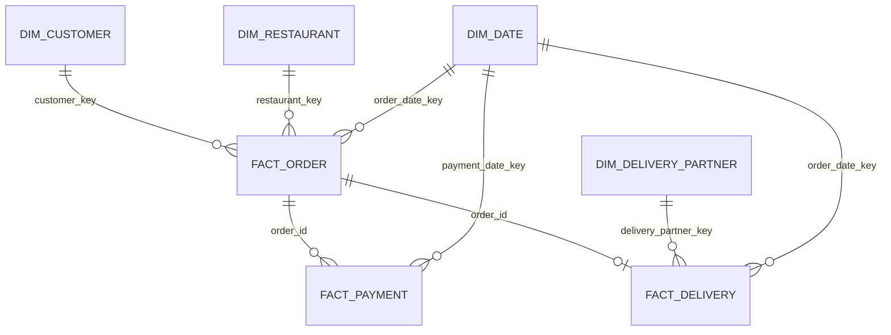
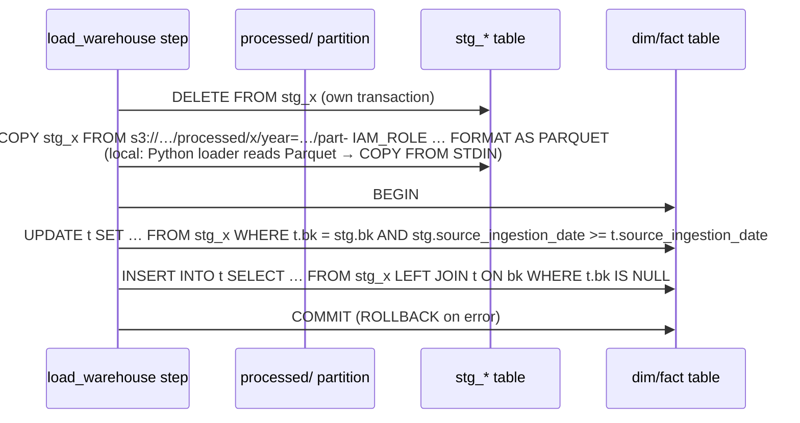

# 08 — Data Warehouse Specification

Covers FR-050 – FR-063. Target: **Amazon Redshift Serverless**; local mode: **PostgreSQL 16** with the same logical model.

---

## 1. Design Summary

| Decision | Choice | Reason |
|---|---|---|
| Model | Kimball star schema: 4 dimensions, 3 facts | Required; simple for Power BI. |
| Schema | One schema, name from `REDSHIFT_SCHEMA` (default `food_delivery`) | Keeps grants and Power BI setup simple. |
| Surrogate keys | `BIGINT IDENTITY` (Redshift) / `GENERATED BY DEFAULT AS IDENTITY` (PostgreSQL); `dim_date.date_key = YYYYMMDD` | Stable keys independent of source IDs. |
| Dimension history | SCD Type 1 (overwrite) | Portfolio simplicity; SCD2 listed as future improvement. |
| Constraints | PRIMARY KEY / UNIQUE declared but **not relied on** (Redshift does not enforce them) | Correctness is enforced by the pipeline and post-load checks (WQ-002 – WQ-004). |
| Loading | Staging tables + UPDATE-then-INSERT upsert per table in one transaction | Works identically on Redshift and PostgreSQL; preserves surrogate keys. |
| Dialects | Separate DDL per engine (`sql/ddl/redshift/`, `sql/ddl/postgres/`); shared DML (`sql/staging/`, `sql/warehouse/`, `sql/analytics/`) written in the common SQL subset | DDL differences (IDENTITY, DISTKEY/SORTKEY) are small and isolated. |

## 2. Star Schema Diagram



`order_id` is a **degenerate dimension** on `fact_payment` and `fact_delivery` (as specified in `project_details.md` §15), used to relate facts to orders.

## 3. Common Columns

| Column | Type | Tables | Meaning |
|---|---|---|---|
| source_ingestion_date | DATE | all dims & facts | Run date of the batch that last wrote the row (stale-batch guard, lineage). |
| created_at | TIMESTAMP | all dims & facts | UTC time the row was first inserted. |
| updated_at | TIMESTAMP | all dims & facts | UTC time the row was last changed. |

These are additions to the column lists in `project_details.md` §15 (needed for incremental/idempotent loading). `fact_order.order_timestamp`, `fact_payment.payment_timestamp`, `fact_delivery.order_date_key` are also additions, justified below.

## 4. Dimensions

### dim_customer

| Aspect | Specification |
|---|---|
| Purpose | One row per customer, descriptive attributes for slicing orders. |
| Grain | One row per `customer_id` (current state, SCD1). |
| Keys | PK `customer_key`; business key `customer_id` (unique). |
| Relationships | `fact_order.customer_key`. |
| Load strategy | Upsert from `stg_customer`; UPDATE changed attributes when batch is not stale; INSERT new IDs. |
| Redshift distribution | `DISTSTYLE ALL`, `SORTKEY (customer_id)`. |

| Column | Type | Null |
|---|---|---|
| customer_key | BIGINT IDENTITY | No |
| customer_id | VARCHAR(10) | No |
| customer_name | VARCHAR(100) | No |
| email | VARCHAR(150) | Yes |
| city | VARCHAR(50) | No |
| signup_date | DATE | No |
| source_ingestion_date, created_at, updated_at | see §3 | No |

### dim_restaurant

| Aspect | Specification |
|---|---|
| Purpose | Restaurant attributes (city, cuisine, rating). |
| Grain | One row per `restaurant_id` (SCD1). |
| Keys | PK `restaurant_key`; BK `restaurant_id`. |
| Relationships | `fact_order.restaurant_key`. |
| Load strategy | Upsert from `stg_restaurant`. |
| Distribution | `DISTSTYLE ALL`, `SORTKEY (restaurant_id)`. |

| Column | Type | Null |
|---|---|---|
| restaurant_key | BIGINT IDENTITY | No |
| restaurant_id | VARCHAR(10) | No |
| restaurant_name | VARCHAR(100) | No |
| city | VARCHAR(50) | No |
| cuisine | VARCHAR(50) | No |
| rating | DECIMAL(2,1) | Yes |
| source_ingestion_date, created_at, updated_at | see §3 | No |

### dim_delivery_partner

| Aspect | Specification |
|---|---|
| Purpose | Delivery partner attributes. |
| Grain | One row per `delivery_partner_id` (SCD1). |
| Keys | PK `delivery_partner_key`; BK `delivery_partner_id`. |
| Relationships | `fact_delivery.delivery_partner_key`. |
| Load strategy | Upsert from `stg_delivery_partner`. |
| Distribution | `DISTSTYLE ALL`, `SORTKEY (delivery_partner_id)`. |

| Column | Type | Null |
|---|---|---|
| delivery_partner_key | BIGINT IDENTITY | No |
| delivery_partner_id | VARCHAR(10) | No |
| partner_name | VARCHAR(100) | No |
| city | VARCHAR(50) | No |
| joining_date | DATE | No |
| source_ingestion_date, created_at, updated_at | see §3 | No |

### dim_date

| Aspect | Specification |
|---|---|
| Purpose | Calendar attributes for all date keys. |
| Grain | One row per calendar day, 2025-01-01 → 2027-12-31 (1,095 rows). |
| Keys | PK `date_key` (INT, `YYYYMMDD`). |
| Relationships | `fact_order.order_date_key`, `fact_payment.payment_date_key`, `fact_delivery.order_date_key`. |
| Load strategy | Generated once by `init-warehouse` (idempotent: insert missing dates only). |
| Distribution | `DISTSTYLE ALL`, `SORTKEY (date_key)`. |

| Column | Type |
|---|---|
| date_key | INTEGER |
| full_date | DATE |
| day_of_month | SMALLINT |
| day_of_week | SMALLINT (ISO, 1 = Monday) |
| day_name | VARCHAR(10) |
| week_of_year | SMALLINT |
| month | SMALLINT |
| month_name | VARCHAR(10) |
| quarter | SMALLINT |
| year | SMALLINT |
| is_weekend | BOOLEAN |

## 5. Facts

### fact_order

| Aspect | Specification |
|---|---|
| Purpose | Order volume, value, and status. |
| **Grain** | **One row per order (`order_id`), holding its latest known status.** (Accumulating-snapshot style: status updates overwrite.) |
| Keys | PK `order_key`; BK `order_id`; FKs `customer_key`, `restaurant_key`, `order_date_key`. |
| Load strategy | Upsert from `stg_order` joined to `dim_customer`/`dim_restaurant` on business keys; `order_date_key = YYYYMMDD(order_date)`. |
| Distribution | `DISTKEY (order_id)`, `SORTKEY (order_date_key)` — co-located with payments/deliveries on `order_id`. |

| Column | Type | Null | Note |
|---|---|---|---|
| order_key | BIGINT IDENTITY | No | |
| order_id | VARCHAR(12) | No | |
| customer_key | BIGINT | No | |
| restaurant_key | BIGINT | No | |
| order_date_key | INTEGER | No | |
| order_timestamp | TIMESTAMP | No | Added: needed for peak-hour analysis (M-12). |
| order_amount | DECIMAL(10,2) | No | |
| order_status | VARCHAR(20) | No | |
| source_ingestion_date, created_at, updated_at | | No | `created_at` per requirements; `updated_at` added. |

### fact_payment

| Aspect | Specification |
|---|---|
| Purpose | Payment attempts, methods, outcomes, revenue. |
| **Grain** | **One row per payment transaction (`payment_id`).** |
| Keys | PK `payment_key`; BK `payment_id`; degenerate `order_id`; FK `payment_date_key`. |
| Load strategy | Upsert from `stg_payment`; `payment_date_key = YYYYMMDD(payment_date)`. |
| Distribution | `DISTKEY (order_id)`, `SORTKEY (payment_date_key)`. |

| Column | Type | Null |
|---|---|---|
| payment_key | BIGINT IDENTITY | No |
| payment_id | VARCHAR(12) | No |
| order_id | VARCHAR(12) | No |
| payment_method | VARCHAR(10) | No |
| payment_amount | DECIMAL(10,2) | No |
| payment_status | VARCHAR(10) | No |
| payment_date_key | INTEGER | No |
| payment_timestamp | TIMESTAMP | No |
| source_ingestion_date, created_at, updated_at | | No |

### fact_delivery

| Aspect | Specification |
|---|---|
| Purpose | Delivery timings and outcomes. |
| **Grain** | **One row per delivery (`delivery_id`), latest known status.** |
| Keys | PK `delivery_key`; BK `delivery_id`; degenerate `order_id`; FKs `delivery_partner_key`, `order_date_key`. |
| Load strategy | Upsert from `stg_delivery` joined to `dim_delivery_partner`. |
| Distribution | `DISTKEY (order_id)`, `SORTKEY (order_date_key)`. |

| Column | Type | Null | Note |
|---|---|---|---|
| delivery_key | BIGINT IDENTITY | No | |
| delivery_id | VARCHAR(12) | No | |
| order_id | VARCHAR(12) | No | |
| delivery_partner_key | BIGINT | No | |
| order_date_key | INTEGER | No | Added: order date of the related order, for daily delivery metrics. |
| pickup_time | TIMESTAMP | Yes | |
| delivery_time | TIMESTAMP | Yes | |
| delivery_duration_minutes | DECIMAL(8,2) | Yes | Computed in PySpark. |
| delivery_status | VARCHAR(12) | No | |
| source_ingestion_date, created_at, updated_at | | No | |

## 6. Staging and Audit Tables

| Table | Purpose |
|---|---|
| `stg_customer`, `stg_restaurant`, `stg_delivery_partner`, `stg_order`, `stg_payment`, `stg_delivery` | Same columns as the processed Parquet (spec 07 §6). Cleared before each table load. |
| `stg_daily_order_metrics` | PySpark metrics for AOV reconciliation (WQ-005). |
| `pipeline_run_audit` | Monitoring (spec 12 §4). Grain: one row per `run_id` × `dataset` × `stage`. |

## 7. Loading Strategy



**Load order:** `dim_date` (ensure) → `dim_customer`, `dim_restaurant`, `dim_delivery_partner` → `fact_order` → `fact_payment`, `fact_delivery` → `stg_daily_order_metrics`.

**Incremental behaviour:** only the current run-date partition is staged. New business keys are inserted; existing keys are updated (status changes, attribute changes); `updated_at` = load time; `created_at` untouched on update.

**Idempotency:** re-staging the same partition and re-running the upsert changes nothing except `updated_at` — no duplicate business keys (FR-092).

**Surrogate-key lookups:** facts resolve dimension keys with `JOIN dim_x ON dim_x.bk = stg.bk` (the INSERT uses `LEFT JOIN`, so a missing dimension row gives a NULL key that the `NOT NULL` constraint rejects — enforced on Redshift too — instead of silently dropping the fact). Since validation guarantees parents exist, an unmatched key is a bug → caught by the constraint, WQ-003, and the transaction's final check that every staged business key exists in the target.

**Staging row count:** after loading, `stg_x` must hold exactly the partition's `_manifest.json` `row_count`, otherwise the load stops before the upsert. Staging keeps the batch after the load so post-load checks (WQ-001, WQ-005) can read it.

**SQL files:**

```text
sql/ddl/redshift/     01_schema.sql, 02_dimensions.sql, 03_facts.sql, 04_staging.sql, 05_audit.sql
sql/ddl/postgres/     same file names, PostgreSQL dialect
sql/staging/          copy_from_s3.sql (one Redshift COPY template for all staging tables)
sql/warehouse/        upsert_dim_customer.sql … upsert_fact_delivery.sql, populate_dim_date.sql,
                      checks/wq_002 … wq_006_*.sql (post-load checks; WQ-001 is in Python)
sql/analytics/        01_…15_*.sql, views/vw_*.sql
```

SQL templates use named parameters (`%(run_date)s`, `{schema}` placeholders filled from config) — never string-concatenated user input.

## 8. Power BI Views

| View | Grain | Columns |
|---|---|---|
| vw_daily_orders | order date | order_date, total_orders, delivered_orders, cancelled_orders, cancellation_rate_pct |
| vw_daily_revenue | order date | order_date, paid_orders, total_revenue, average_order_value |
| vw_restaurant_performance | restaurant | restaurant_id, restaurant_name, city, cuisine, rating, total_orders, total_revenue, average_order_value, cancellation_rate_pct, avg_delivery_minutes |
| vw_delivery_performance | order date × restaurant city | order_date, city, total_deliveries, completed_deliveries, failed_deliveries, avg_delivery_minutes, late_deliveries, late_delivery_rate_pct |
| vw_customer_summary | customer | customer_id, customer_name, city, signup_date, total_orders, total_spend, first_order_date, last_order_date, is_repeat_customer |
| vw_payment_summary | payment date × method × status | payment_date, payment_method, payment_status, payment_count, total_amount |

Metric logic follows spec 02. Views are plain (non-materialised) views; materialised views are a future improvement if performance requires.

## 9. Access

| Principal | Access |
|---|---|
| Pipeline (admin/secret from Secrets Manager) | DDL + DML on schema. |
| `powerbi_reader` user | `USAGE` on schema, `SELECT` on `vw_*` views only. Created by an optional script `sql/ddl/redshift/06_powerbi_reader.sql` with password supplied at runtime (never committed). |
