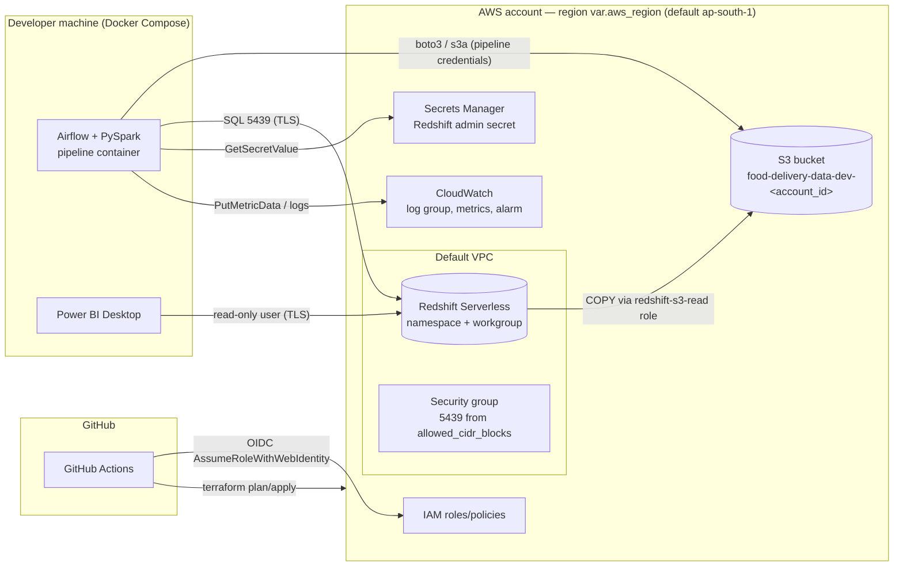

# 09 — AWS Infrastructure Specification

Covers FR-120 – FR-125, FR-130 – FR-135. All resources are defined in Terraform (`terraform/`, spec 10 §4). One environment: `dev`.

---

## 1. Principles

- **Minimal:** only S3, Redshift Serverless, IAM, CloudWatch, Secrets Manager (+ the default VPC networking they need).
- **Compute stays local:** Airflow and Spark run in Docker (developer machine). AWS hosts storage, warehouse, secrets, and monitoring. No EC2/EMR/Glue/Lambda/EKS (assumption A-03).
- **Cost-aware:** serverless/pay-per-use; usage limit on Redshift; everything removable with `terraform destroy`.
- **Secure by default:** private bucket, encryption, least privilege, no long-lived keys in GitHub.

## 2. Environment Architecture

## 3. Services

### 3.1 Amazon S3

| Aspect | Specification |
|---|---|
| Why required | Durable, cheap data lake storage decoupled from the warehouse; Redshift COPY reads Parquet directly from it. |
| What it stores | `raw/`, `validated/`, `processed/`, `quarantine/`, `reports/` (spec 07 §4). |
| Pipeline connection | Ingestion writes via boto3; Spark reads/writes via `s3a://` (hadoop-aws 3.5.0 + AWS SDK v2 bundle 2.35.4, matching the Hadoop inside PySpark 4.2.0; installed in the image with pinned SHA-1 checksums; credentials via the SDK v2 default chain so a named AWS profile works); Redshift `COPY` reads `processed/`. |
| Configuration | Name `${var.bucket_name}` (default `food-delivery-data-${environment}-${account_id}` for global uniqueness); versioning disabled (data reproducible from source; saves cost); SSE-S3 (AES-256); lifecycle: `_tmp/` expire 1 day (staging left by crashed runs), `validated/` expire 7 days, `quarantine/` expire 90 days, `reports/` expire 365 days; abort incomplete multipart uploads after 7 days. |
| Security | Block Public Access (all four settings); bucket policy denies `aws:SecureTransport = false`; access only via the pipeline role and the Redshift role (prefix-scoped). |

### 3.2 Amazon Redshift Serverless

| Aspect | Specification |
|---|---|
| Why required | Required warehouse; Serverless avoids paying for an always-on cluster and has no node management. |
| What it stores/does | Star schema, staging, audit table, analytics views (spec 08). |
| Pipeline connection | `load_warehouse` and `run_dq_checks` connect with psycopg2 over TLS (`sslmode=require`) on port 5439; `COPY` uses the attached IAM role. |
| Configuration | `aws_redshiftserverless_namespace` (db `${var.database_name}` default `food_delivery`, `manage_admin_password = true`, IAM role attached); `aws_redshiftserverless_workgroup` (base capacity 8 RPU — the minimum, publicly accessible = true, default VPC subnets, dedicated SG); `aws_redshiftserverless_usage_limit` (e.g. 10 RPU-hours/day, action `deactivate` or `log`). |
| Security | Admin password generated and stored by AWS in Secrets Manager; SG allows 5439 only from `var.allowed_cidr_blocks` (developer IP /32); TLS enforced; Power BI uses a read-only user. Public accessibility is a documented portfolio trade-off (risk SR-02). |

### 3.3 IAM

| Role / policy | Trusted by | Permissions (least privilege) |
|---|---|---|
| `food-delivery-pipeline-<env>` role + policy | Developer's IAM principal (assumed via AWS profile) | `s3:ListBucket` on bucket; `s3:GetObject/PutObject/DeleteObject` on bucket/*; `secretsmanager:GetSecretValue` on the Redshift secret ARN; `cloudwatch:PutMetricData` with condition `cloudwatch:namespace = FoodDelivery/Pipeline`; `logs:CreateLogStream/PutLogEvents` on the pipeline log group; `redshift-serverless:GetCredentials`/`GetWorkgroup` on the workgroup. |
| `food-delivery-redshift-s3-read-<env>` role | `redshift.amazonaws.com`, `redshift-serverless.amazonaws.com` | `s3:GetObject`, `s3:ListBucket` on `processed/*` only. |
| `food-delivery-github-deploy-<env>` role | GitHub OIDC provider, `sub` restricted to `repo:<owner>/<repo>:environment:dev` (and `ref:refs/heads/main` for plan) | Permissions to manage only this project's resources (S3, Redshift Serverless, IAM roles with the project prefix, CloudWatch, Secrets Manager read of the Redshift secret) + Terraform state access if remote state is enabled. |
| GitHub OIDC provider | — | `token.actions.githubusercontent.com`, audience `sts.amazonaws.com`. |

- Why required: every AWS call must be authorised without static keys in code.
- Security: no wildcard `*:*`; roles are project-prefixed; no IAM users with access keys created by Terraform.

### 3.3.1 Sandbox account mode (target deployment account)

The project is deployed to a **temporary AWS sandbox account** where IAM user creation is not possible (assumption A-21). Such accounts typically provide short-lived credentials, may restrict IAM role / OIDC provider creation, allow only a subset of services, and are wiped when the session ends. Terraform therefore exposes feature flags so the same code works in a sandbox and in a normal account:

| Variable | Default | Effect when `false` |
|---|---|---|
| `create_pipeline_role` | `false` | The pipeline uses the sandbox's own temporary credentials (AWS profile) instead of assuming a dedicated role. |
| `create_redshift_s3_role` | `true` | If role creation is blocked, COPY falls back to temporary session credentials passed at runtime (`CREDENTIALS 'aws_access_key_id=…;aws_secret_access_key=…;token=…'`), taken from the credential chain, never logged or stored. Selected by `REDSHIFT_COPY_AUTH=iam_role\|session`. |
| `create_github_oidc` | `false` | No OIDC provider/deploy role; Terraform is applied from the developer machine; `deploy.yml` stays in the repo as a documented template for a normal account. |

Rules that do not change in sandbox mode: no IAM users or access keys are created; sandbox credentials are **never** stored in GitHub secrets, `.env.example`, code, or images; they live only in the local AWS profile / untracked `.env`.

Before Phase 13 the sandbox's allowed-service list is checked (S3, Redshift Serverless, IAM role creation, Secrets Manager, CloudWatch). If Redshift Serverless is not allowed, the fallback is a single-node provisioned Redshift cluster (smallest available node type) behind a `redshift_deployment = "serverless" | "provisioned"` variable, decided at that point — not built speculatively.

Because the account is wiped at session end: local Terraform state is disposable, the whole environment must be re-creatable with one `terraform apply` + `init-warehouse` + historical run, and evidence (screenshots, log excerpts) is captured during the session.

### 3.4 Amazon CloudWatch

| Aspect | Specification |
|---|---|
| Why required | Central place for pipeline metrics, alarms, and (optional) logs in AWS mode. |
| What it stores/does | Custom metrics namespace `FoodDelivery/Pipeline` (spec 12 §3); log group `/food-delivery/<env>/pipeline` (retention 30 days); alarm `food-delivery-<env>-pipeline-failure` (`PipelineFailure` sum ≥ 1 in 1 day); optional small dashboard. |
| Pipeline connection | `src/common/metrics.py` publishes via boto3 when `METRICS_ENABLED=true`; Airflow task logs can optionally use Airflow's CloudWatch remote logging. |
| Security | Pipeline role may only put metrics in its namespace and write to its log group. Logs contain no secrets. |

### 3.5 AWS Secrets Manager

| Aspect | Specification |
|---|---|
| Why required | Keeps the Redshift password out of code, Git, images, and `.env` files in AWS mode. |
| What it stores | Redshift admin credentials (secret created by Redshift Serverless via `manage_admin_password`). Optionally a `powerbi_reader` password secret created manually. |
| Pipeline connection | `config.py` reads `REDSHIFT_SECRET_ARN`; `secrets.py` calls `GetSecretValue` once per process and caches in memory. Local mode uses `REDSHIFT_PASSWORD` from the untracked `.env`. |
| Security | Access only for the pipeline role; secret values never logged; rotation possible (future). |

## 4. Networking

- Default VPC and its subnets (no custom VPC, NAT, or VPN — cost and complexity). Accounts without a default VPC (e.g. the Phase 13 target account in us-east-1) set `vpc_id` and `subnet_ids` to an existing VPC's public subnets (≥ 2 AZs, internet-gateway route); Terraform then only adds the workgroup's security group to that VPC.
- One security group for the workgroup: inbound TCP 5439 from `allowed_cidr_blocks`; outbound all.
- S3 accessed over public AWS endpoints with TLS.

## 5. Naming and Tagging

- Prefix: `food-delivery-<env>-…`.
- Default tags via provider: `Project = food-delivery-data-platform`, `Environment = <env>`, `ManagedBy = terraform`.

## 6. Terraform State

- Default: local state (`terraform.tfstate`, git-ignored) — simplest for a single developer.
- Optional: S3 backend (separate bootstrap bucket) documented for team use / CI apply. `deploy.yml` apply requires the remote backend; until it is configured, `deploy.yml` runs `plan` only (assumption A-12).

## 7. Local Equivalents (Development Mode)

| AWS service | Local replacement | Selected by |
|---|---|---|
| S3 | Local folder `./lake` mounted into containers | `STORAGE_MODE=local` |
| Redshift | PostgreSQL 16 database `warehouse` in the Compose Postgres container | `WAREHOUSE_TYPE=postgres` |
| Secrets Manager | `.env` (untracked) → environment variables | `REDSHIFT_SECRET_ARN` unset |
| CloudWatch metrics | Log lines `METRIC name=value` | `METRICS_ENABLED=false` |
| Redshift COPY | Python loader (pyarrow → `COPY FROM STDIN`) | `WAREHOUSE_TYPE=postgres` |

## 8. Estimated Cost (dev, idle most of the time)

| Service | Expectation |
|---|---|
| S3 | < 1 GB → cents/month. |
| Redshift Serverless | Billed per RPU-second while queries run (8 RPU minimum, 60 s minimum charge). A few short daily runs + occasional Power BI refresh: a few USD/month. New accounts may have a free-trial credit. Usage limit caps runaway cost. Storage billed separately (small). |
| Secrets Manager | ~USD 0.40/secret/month. |
| CloudWatch | Custom metrics ~USD 0.30/metric/month (≈ 6 metrics), alarm ~USD 0.10. |

Always check current AWS pricing; destroy the environment when not demonstrating (`terraform destroy`).
