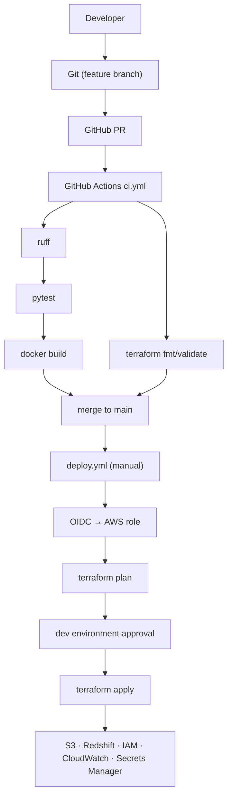

# 10 — DevOps Specification

Covers FR-110 – FR-114, FR-120, FR-126, FR-127.

---

## 1. Git

| Topic | Decision |
|---|---|
| Hosting | GitHub repository `food-delivery-data-platform`. |
| Branching | **GitHub Flow**: `main` is always releasable; short-lived branches `feat/…`, `fix/…`, `test/…`, `docs/…`, `ci/…`, `infra/…`; merge via pull request after CI passes. |
| Protection | `main` protected: PR required, CI status checks (`lint-test`, `dag-integrity`, `docker-build`, `terraform-validate`) required, no force-push. |
| Commits | Conventional Commits: `feat:`, `fix:`, `test:`, `docs:`, `ci:`, `infra:`, `refactor:`, `chore:`. One logical change per commit; at least one commit per phase (e.g. `feat: add synthetic food delivery data generator`). No single giant commit. |
| Tags | Optional `v0.<phase>` tags at phase completion. |
| Ignored | See spec 11 §9 `.gitignore`. |

The working folder is not yet a Git repository; `git init` happens in Phase 1.

## 2. Docker

### Images

| Image | Dockerfile | Base | Contents | Used by |
|---|---|---|---|---|
| Pipeline app | `Dockerfile` | `python:3.12.14-slim-trixie` (pinned) | OpenJDK 21 JRE headless (`JAVA_HOME=/usr/lib/jvm/java-21`), pinned s3a jars (`docker/install_s3a_jars.py`, SHA-1 checked), `requirements.txt`, `pyproject.toml`, `src/`, `scripts/`, `sql/`; non-root `app` user (uid 1000); `ENTRYPOINT ["python","-m","src.cli"]`, `CMD ["--help"]`. Targets: `runtime` (default, last stage) and `dev` (+ `requirements-dev.txt`, `tests/`, `data/sample/`; used by Compose) | Manual/CLI runs, CI build, tests in container |
| Airflow | `docker/airflow/Dockerfile` | `apache/airflow:3.3.2-python3.12` (pinned) | Java 21 JRE (copied from `eclipse-temurin:21.0.12.1_1-jre` — the Debian bookworm base has no Java 21 package), the same s3a jars, project requirements installed with `apache-airflow` pinned (boto3 left at Airflow's version: its Amazon provider pins botocore), `pip check` at build; project code copied (bind-mounted over it in development) | Airflow scheduler/API server/DAG processor |

### Compose services (`docker-compose.yml`)

| Service | Purpose |
|---|---|
| `postgres` | PostgreSQL 16. Databases: `warehouse` (local warehouse, created by the image from `REDSHIFT_*`) and `airflow` (metadata, created by `airflow-init`). Named volume. Healthcheck. |
| `airflow-init` | One-off: `docker/airflow/bootstrap.py db` creates the `airflow` role/database if missing (works on new and existing volumes, unlike `docker-entrypoint-initdb.d`), then `airflow db migrate`. |
| `airflow` | Single container running all Airflow 3 components (scheduler, API server/UI on `localhost:8080`, DAG processor, triggerer) via `airflow standalone`, LocalExecutor (parallelism 1), Postgres metadata DB. Tasks — including Spark local mode — run here. Chosen over one container per component to fit the 8 GB host (TR-03); splitting into separate services is a documented option for bigger machines. Login: SimpleAuthManager user `AIRFLOW_ADMIN_USERNAME`, password file written from `AIRFLOW_ADMIN_PASSWORD` at start (`bootstrap.py auth`). Runs as uid `AIRFLOW_UID` (default 1000 = the pipeline image's `app` user) so both containers can write the mounted `lake/` and `data/`. |
| `pipeline` | Pipeline app container (`dev` target) for CLI runs (`docker compose run --rm pipeline run-pipeline …`), data generation, and tests (`--entrypoint pytest`). Not in a profile, so `docker compose build` builds it; `docker compose up` only prints the CLI help and exits. |

Mounts: the repository at `/opt/project` (covers `lake/`, `data/`, `src/`, `sql/`, `airflow/dags/` — dev live-reload) and `./airflow/logs`; `~/.aws` read-only at `/opt/aws` only in AWS mode, via the override file `docker-compose.aws.yml` (sets `AWS_CONFIG_FILE`/`AWS_SHARED_CREDENTIALS_FILE`, because the Airflow container's arbitrary uid has no fixed home directory). Configuration via `env_file: .env`. Memory limits: postgres 512m, pipeline 2g, airflow 3g.

Resource guidance (8 GB host): `%UserProfile%\.wslconfig` with `memory=5GB`, `swap=4GB`; Spark driver 1 GB; Airflow parallelism 1; run `docker compose stop airflow` when only using the CLI/tests. Target peak usage: Postgres ~0.2 GB + Airflow ~1.5 GB + Spark ~1.5 GB.

### Why containers from Phase 1

The development host is Windows. PySpark on native Windows needs Hadoop `winutils` and is fragile. All Python/Spark execution therefore runs in Linux containers (or WSL2) from Phase 1 onward; Phase 10 hardens the images (assumption A-02).

## 3. GitHub Actions

### `ci.yml` — triggers: `push` (all branches), `pull_request` (to `main`)

```text
job lint-test (ubuntu-latest, Python 3.12, Java 21 via actions/setup-java)
  Checkout
   ↓
  Setup Python (pip cache)
   ↓
  Install dependencies (requirements.txt + requirements-dev.txt)
   ↓
  Lint: ruff check . && ruff format --check .
   ↓
  Tests: pytest -m "not aws" --cov  (service container: postgres:16 for integration tests)
   ↓
  Upload coverage report artifact

job dag-integrity
  Checkout → build/install Airflow (with constraints) → pytest tests/unit/test_dag_integrity.py

job docker-build (needs lint-test)
  Checkout → docker/setup-buildx → build Dockerfile and docker/airflow/Dockerfile (no push)

job terraform-validate (parallel)
  Checkout → setup-terraform → terraform fmt -check -recursive → terraform init -backend=false → terraform validate
```

- No AWS credentials in CI; S3 is mocked with moto; warehouse tests use the Postgres service container.
- Concurrency group per branch cancels superseded runs.
- Permissions: `contents: read`.

### `deploy.yml` — trigger: `workflow_dispatch` (input `action`: `plan` | `apply`)

```text
Checkout
 ↓
Configure AWS credentials via OIDC (aws-actions/configure-aws-credentials, role ARN from repo variable)
 ↓
Setup Terraform
 ↓
terraform init (remote backend)
 ↓
terraform plan -out=tfplan
 ↓
[apply only] environment "dev" (required reviewer) → terraform apply tfplan
```

- Permissions: `id-token: write`, `contents: read`.
- Non-secret inputs (`AWS_REGION`, role ARN, `allowed_cidr_blocks`) stored as GitHub repository/environment **variables**; nothing sensitive stored.

## 4. Terraform

```text
terraform/
├── providers.tf              # required_version, aws provider ~> 5.x, default_tags
├── main.tf                   # locals (name prefix, account id), data sources (default VPC/subnets)
├── variables.tf              # environment, aws_region, bucket_name, database_name, allowed_cidr_blocks,
│                             # github_repository, redshift_base_capacity, redshift_usage_limit_rpu_hours
├── outputs.tf                # bucket name, workgroup endpoint, secret ARN, role ARNs, log group
├── s3.tf                     # bucket, public access block, encryption, policy, lifecycle
├── iam.tf                    # pipeline role/policy, redshift s3-read role, GitHub OIDC provider + deploy role
├── redshift.tf               # namespace, workgroup, security group, usage limit
├── cloudwatch.tf             # log group, failure alarm, optional dashboard
└── terraform.tfvars.example  # placeholders only; real terraform.tfvars is git-ignored
```

Rules: no credentials in `.tf` files; variables for environment/region/bucket/database; `terraform fmt` enforced in CI; single root module (no custom modules — unnecessary for this size).

## 5. Deployment Workflow

```text
Developer
 ↓  feature branch, local tests in Docker
Git
 ↓  conventional commits
GitHub
 ↓  pull request
GitHub Actions (ci.yml)
 ↓  lint → pytest → Docker build → terraform validate
Tests
 ↓  merge to main when green
Docker
 ↓  images build reproducibly (run locally via Compose)
Terraform / AWS
    deploy.yml (manual, OIDC) → plan → approved apply → S3, Redshift, IAM, CloudWatch
```



**Application runtime deployment:** the pipeline runs in Docker Compose on the developer machine pointing at AWS (set `STORAGE_MODE=s3`, `WAREHOUSE_TYPE=redshift`, `METRICS_ENABLED=true`, AWS profile). Hosting Airflow in AWS (MWAA/EC2) is a documented future improvement, not part of scope.

## 6. Local Developer Workflow

```text
cp .env.example .env
docker compose build
docker compose run --rm pipeline generate-data --mode historical
docker compose run --rm pipeline init-warehouse
docker compose up -d                  # Airflow at http://localhost:8080
# trigger food_delivery_pipeline with {"load_type": "historical"}
docker compose run --rm --entrypoint pytest pipeline
# AWS mode: docker compose -f docker-compose.yml -f docker-compose.aws.yml …
```

Exact commands are finalised in the README (Phase 15).
